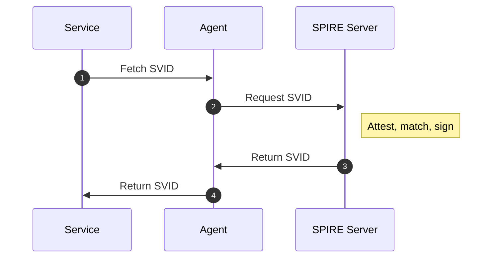
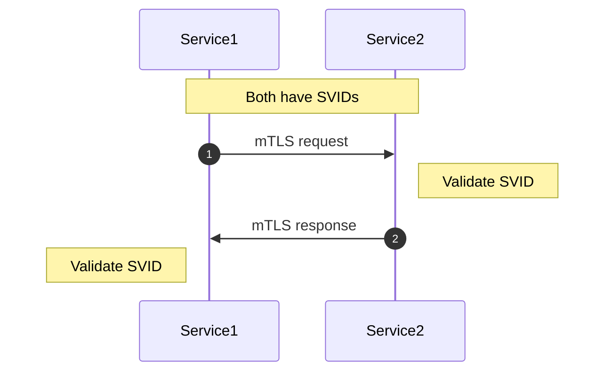
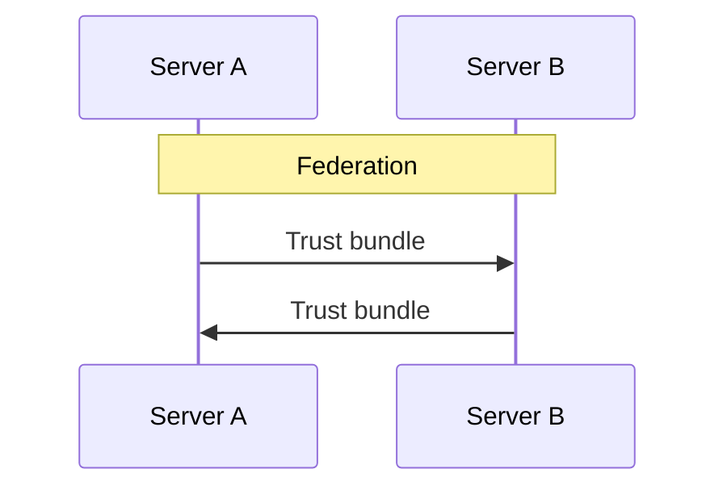
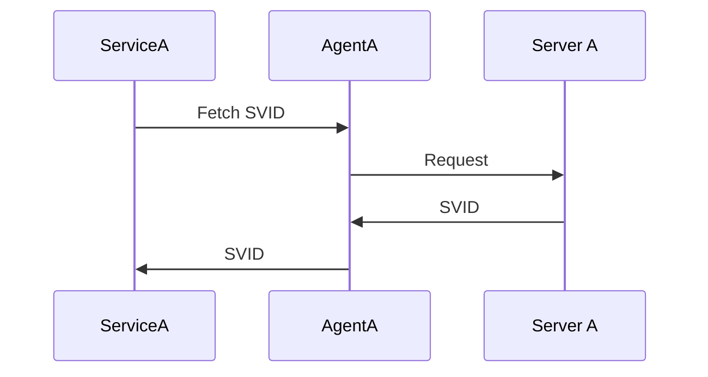
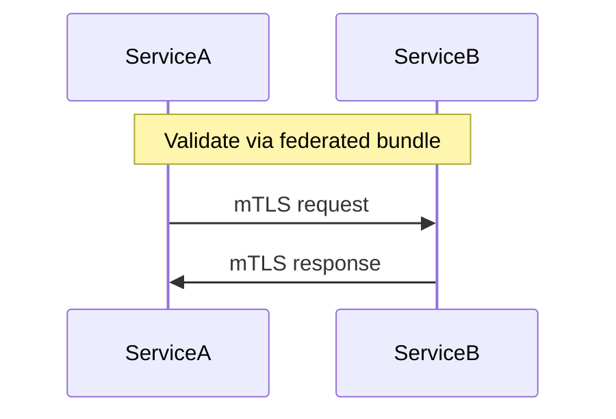
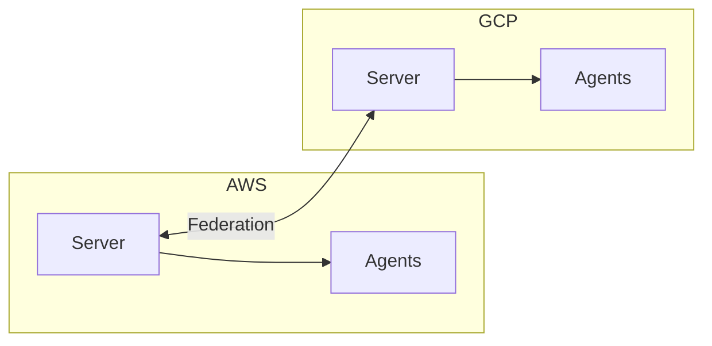

# SPIFFE/SPIRE Flow & Topology

Sequence diagrams and guidance on where to run the SPIRE Server when services span clouds.

---

## Key Point: Services Don't Go Through the Server

The SPIRE Server is **not** in the request path between Service1 and Service2. It only:

1. Issues SVIDs to agents (and workloads, via agents)
2. Stores registration entries

**Service-to-service traffic** uses mTLS directly between the two services. Each service gets its SVID from its local Agent, which gets it from the Server. Once both have SVIDs, they talk to each other without the Server.

---

## Sequence 1: Single Cloud – How a Service Gets Its Identity



**Steps:**

1. Service1 calls the Workload API (Unix socket) on its node’s Agent.
2. Agent checks cache; if missing, requests SVID from Server.
3. Server attests the workload, matches selectors to registration entries, signs SVID.
4. Agent caches and returns SVID to Service1.
5. Service1 uses the SVID for mTLS (e.g., with Envoy or app-level TLS).

---

## Sequence 2: Service1 → Service2 (Same Cloud)



**Flow:** Service1 and Service2 each got their SVID from their local Agent (which got it from the Server). They then communicate directly over mTLS. The SPIRE Server is not involved in this traffic.

---

## Sequence 3a: Cross-Cloud – Federation (Servers Exchange Trust Bundles)



## Sequence 3b: Cross-Cloud – Cloud A Service Gets SVID



## Sequence 3c: Cross-Cloud – ServiceA to ServiceB (mTLS)



**Flow:**

1. ServiceA gets SVID from Agent A → Server A (trust domain `cluster1.com`).
2. ServiceB gets SVID from Agent B → Server B (trust domain `cluster2.com`).
3. Servers A and B exchange trust bundles (federation).
4. ServiceA and ServiceB communicate over mTLS. Each validates the other’s SVID using the federated trust bundle.

---

## Where to Run the SPIRE Server

### Single Cluster (One Cloud)

| Option | Where | When to Use |
|--------|-------|-------------|
| **Control plane** | Same cluster as workloads | Typical for single-cluster K8s |
| **Dedicated node(s)** | Node(s) reserved for SPIRE | When you want isolation from app workloads |

**Kubernetes:** Run as a StatefulSet in a dedicated namespace (e.g. `spire`). Often on control-plane nodes or a small pool of system nodes.

---

### Multi-Cluster (Same Cloud)

| Option | Where | When to Use |
|--------|-------|-------------|
| **One Server per cluster** | Each cluster has its own Server | Simple, clear boundaries |
| **Shared Server** | One Server serves multiple clusters | Centralized management; needs network access from all clusters |

**Typical:** One SPIRE Server per cluster. Agents in each cluster talk to that cluster’s Server.

---

### Multi-Cloud / Hybrid

| Option | Where | When to Use |
|--------|-------|-------------|
| **One Server per cloud/region** | E.g. Server in AWS, Server in GCP | Each cloud has its own trust domain |
| **Federation** | Servers exchange trust bundles | Services in different clouds need to trust each other |

**Example:**



---

### Server Placement Summary

| Scenario | Server placement |
|----------|------------------|
| **Single K8s cluster** | StatefulSet in that cluster (e.g. `spire` namespace) |
| **Multiple clusters, same org** | One Server per cluster, or one shared Server if network allows |
| **Multi-cloud** | One Server per cloud/region; use federation for cross-cloud trust |
| **High availability** | Multiple Server replicas + shared DB (PostgreSQL/MySQL) |

---

## Data Flow Summary

| Path | Goes through SPIRE Server? |
|------|----------------------------|
| Workload → Agent (fetch SVID) | No – local Unix socket |
| Agent → Server (request SVID) | Yes |
| Service1 → Service2 (mTLS) | No – direct between services |
| Server A ↔ Server B (federation) | Yes – bundle exchange |

**Rule of thumb:** The Server is used for identity issuance and federation. Application traffic stays between services and does not pass through the Server.

---

## Generating Static Images

The diagrams above use [Mermaid](https://mermaid.js.org/) and render in GitHub, GitLab, VS Code, and most Markdown viewers. To generate SVG images (e.g., for PDF export or unsupported renderers):

```bash
./scripts/generate-diagrams.sh
```

Requires Node.js/npx. Source files are in `docs/diagrams/*.mmd`.
